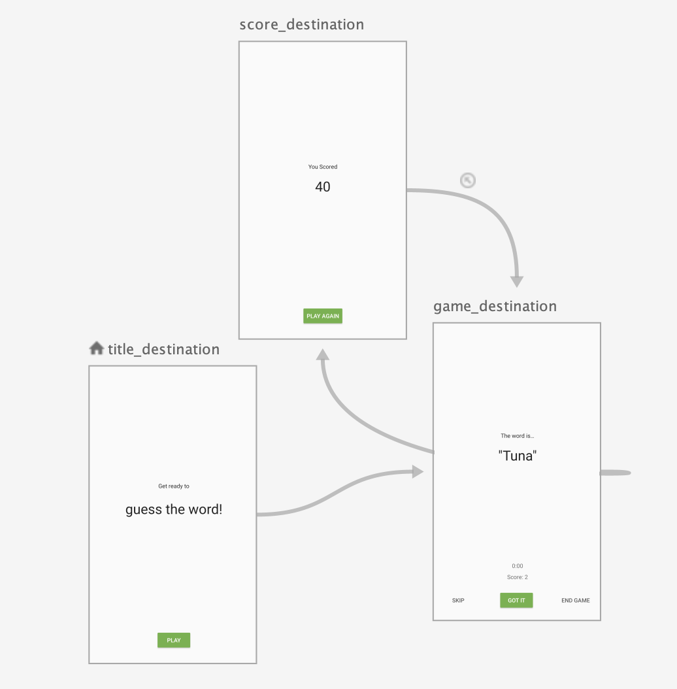
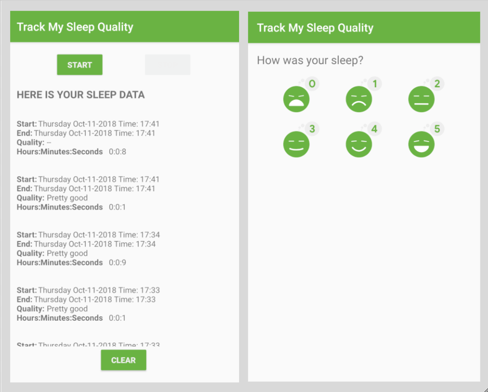
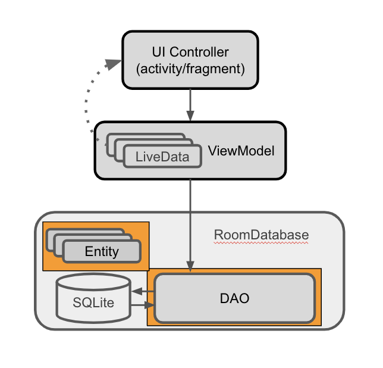
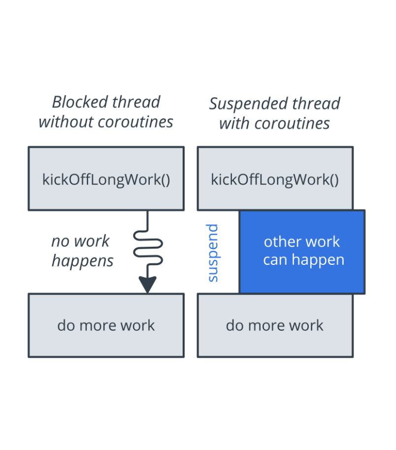

[TOC]

# GuessTheWorld



### UI controller

A *UI controller* is a UI-based class such as `Activity` or `Fragment`. 

A UI controller should **only contain logic that handles UI and operating-system interactions such as displaying views and capturing user input**. 

**Don't put decision-making logic**, such as logic that determines the text to display, into the UI controller.

In the GuessTheWord starter code, the UI controllers are the three fragments: `GameFragment`, `ScoreFragment,` and `TitleFragment`. 

Following the "separation of concerns" design principle, the `GameFragment` is **only responsible for drawing game elements to the screen and knowing when the user taps the buttons, and nothing more**. When the user taps a button, this information is passed to the `GameViewModel`.

### ViewModel

A [`ViewModel`](https://developer.android.com/reference/android/arch/lifecycle/ViewModel) holds data to be displayed in a fragment or activity associated with the `ViewModel`. A `ViewModel` can do simple calculations and transformations on data to prepare the data to be displayed by the UI controller. In this architecture, the `ViewModel` performs the **decision-making**.

The `GameViewModel` holds data like the **score value**, **the list of words**, and **the current word**, because this is the data to be displayed on the screen. The `GameViewModel` also contains the business logic to perform simple calculations to decide what the current state of the data is.

### ViewModelProvider

A [`ViewModelFactory`](https://developer.android.com/reference/android/arch/lifecycle/ViewModelProvider.Factory) instantiates `ViewModel` objects, with or without constructor parameters.


During configuration changes such as screen rotations, UI controllers such as fragments are re-created. However, `ViewModel` instances survive. If you create the `ViewModel` instance using the `ViewModel` class, a new object is created every time the fragment is re-created. Instead, create the `ViewModel` instance using a [`ViewModelProvider`](https://developer.android.com/reference/android/arch/lifecycle/ViewModelProvider).


**Important:** Always use [`ViewModelProvider`](https://developer.android.com/reference/android/arch/lifecycle/ViewModelProvider) to create `ViewModel` objects rather than directly instantiating an instance of `ViewModel`.

How `ViewModelProvider` works:

- `ViewModelProvider` returns an existing `ViewModel` if one exists, or it creates a new one if it does not already exist.
- `ViewModelProvider` creates a `ViewModel` instance in association with the given scope (an activity or a fragment).
- The created `ViewModel` is retained as long as the scope is alive. For example, if the scope is a fragment, the `ViewModel` is retained until the fragment is detached.

### Attach observers to the LiveData objects

**The observer pattern**

The *observer pattern* is a software design pattern. It specifies communication between objects: an *observable* (the "subject" of observation) and *observers*. An observable is an object that notifies observers about the changes in its state.


In the case of `LiveData` in this app, the observable (subject) is the `LiveData` object, and the observers are the methods in the UI controllers, such as fragments. A state change happens whenever the data wrapped inside `LiveData` changes. The `LiveData` classes are crucial in communicating from the `ViewModel` to the fragment.

**code:**

The observer that you just created receives an event when the data held by the observed `LiveData` object changes. Inside the observer, update the score `TextView` with the new score.

```kotlin
viewModel.score.observe(viewLifecycleOwner, Observer { newScore ->
   binding.scoreText.text = newScore.toString()
})
```

### Encapsulate the LiveData

```kotlin
private val _word = MutableLiveData<String>()
val word: LiveData<String>
   get() = _word
```

### Add ViewModel data binding

**Current app architecture:**

In your app, the views are defined in the XML layout, and the data for those views is held in `ViewModel` objects. Between each view and its corresponding `ViewModel` is a UI controller, which acts as a relay between them.


For example:

- The **Got It** button is defined as a `Button` view in the `game_fragment.xml` layout file.
- When the user taps the **Got It** button, a click listener in the `GameFragment` fragment calls the corresponding click listener in `GameViewModel`.
- The score is updated in the `GameViewModel`.

The `Button` view and the `GameViewModel` don't communicate directly—they need the click listener that's in the `GameFragment`.

**ViewModel passed into the data binding**

It would be simpler if the views in the layout communicated directly with the data in the `ViewModel` objects, without relying on UI controllers as intermediaries.


`ViewModel` objects hold all the UI data in the GuessTheWord app. By passing `ViewModel` objects into the data binding, you can automate some of the communication between the views and the `ViewModel` objects.

In this task, you associate the `GameViewModel` and `ScoreViewModel` classes with their corresponding XML layouts. You also set up listener bindings to handle click events.

```kotlin
// Set the viewmodel for databinding - this allows the bound layout access 
// to all the data in the ViewModel
binding.gameViewModel = viewModel
```

Data binding creates a listener and sets the listener on the view. When the listened-for event happens, the listener evaluates the lambda expression. Listener bindings work with the Android Gradle Plugin version 2.0 or higher. To learn more, read [Layouts and binding expressions](https://developer.android.com/topic/libraries/data-binding/expressions#listener_bindings).

### Add transformation for the LiveData

The [`Transformations.map()`](https://developer.android.com/reference/androidx/lifecycle/Transformations.html#map(androidx.lifecycle.LiveData, androidx.arch.core.util.Function)) method provides a way to perform data manipulations on the source `LiveData` and return a result `LiveData` object. These transformations aren't calculated unless an observer is observing the returned `LiveData` object.

This method takes the source `LiveData` and a function as parameters. The function manipulates the source `LiveData`.

**Add hint**

```kotlin
// The Hint for the current word
val wordHint = Transformations.map(word) { word ->
   val randomPosition = (1..word.length).random()
   "Current word has " + word.length + " letters" +
           "\nThe letter at position " + randomPosition + " is " +
           word.get(randomPosition - 1).toUpperCase()
}
```


# TrackMySleepQuality

## overview



## Database

### Create the SleepNight entity



```kotlin
@Entity(tableName = "daily_sleep_quality_table")
data class SleepNight(
       @PrimaryKey(autoGenerate = true)
       var nightId: Long = 0L,

       @ColumnInfo(name = "start_time_milli")
       val startTimeMilli: Long = System.currentTimeMillis(),

       @ColumnInfo(name = "end_time_milli")
       var endTimeMilli: Long = startTimeMilli,

       @ColumnInfo(name = "quality_rating")
       var sleepQuality: Int = -1
)
```

### Create the DAO

When you use a `Room` database, you query the database by defining and calling Kotlin functions in your code. These Kotlin functions map to SQL queries. You define those mappings in a DAO using annotations, and `Room` creates the necessary code.

```kotlin
@Dao
interface SleepDatabaseDao {

    @Insert
    fun insert(night: SleepNight)

    @Update
    fun update(night: SleepNight)

    @Query("SELECT * from daily_sleep_quality_table WHERE nightId = :key")
    fun get(key: Long): SleepNight?

    @Query("DELETE FROM daily_sleep_quality_table")
    fun clear()

    @Query("SELECT * FROM daily_sleep_quality_table ORDER BY nightId DESC LIMIT 1")
    fun getTonight(): SleepNight?

    @Query("SELECT * FROM daily_sleep_quality_table ORDER BY nightId DESC")
    fun getAllNights(): LiveData<List<SleepNight>>
}
```

### Create a Room database

- You only need one instance of the `Room` database for the whole app, so make the `RoomDatabase` a singleton.
- Use `Room`'s database builder to create the database only if the database doesn't exist. Otherwise, return the existing database.

```kotlin
@Database(entities = [SleepNight::class], version = 1, exportSchema = false)
abstract class SleepDatabase : RoomDatabase() {
    abstract val sleepDatabaseDao: SleepDatabaseDao
    companion object {
        @Volatile
        private var INSTANCE: SleepDatabase? = null

        fun getInstance(context: Context): SleepDatabase {
            synchronized(this) {
                var instance = INSTANCE

                if (instance == null) {
                    instance = Room.databaseBuilder(
                            context.applicationContext,
                            SleepDatabase::class.java,
                            "sleep_history_database"
                            )
                            .fallbackToDestructiveMigration()
                            .build()
                    INSTANCE = instance
                }
                return instance
            }
        }
    }
}
```

## Add ViewModel

### Add SleepTrackerViewModel

```kotlin
class SleepTrackerViewModel(
       val database: SleepDatabaseDao,
       application: Application) : AndroidViewModel(application) {
}
```

### Add SleepTrackerViewModelFactory

```kotlin
class SleepTrackerViewModelFactory(
       private val dataSource: SleepDatabaseDao,
       private val application: Application) : ViewModelProvider.Factory {
   @Suppress("unchecked_cast")
   override fun <T : ViewModel?> create(modelClass: Class<T>): T {
       if (modelClass.isAssignableFrom(SleepTrackerViewModel::class.java)) {
           return SleepTrackerViewModel(dataSource, application) as T
       }
       throw IllegalArgumentException("Unknown ViewModel class")
   }
}
```

**Tip:** *This is mostly boilerplate code, so you can reuse the code for future view-model factories*.

### Update SleepTrackerFragment

```kotlin
override fun onCreateView(inflater: LayoutInflater, container: ViewGroup?,
                              savedInstanceState: Bundle?): View? {
        // Get a reference to the binding object and inflate the fragment views.
        val binding: FragmentSleepTrackerBinding = DataBindingUtil.inflate(inflater, R.layout.fragment_sleep_tracker, container, false)
        val application = requireNotNull(this.activity).application
  
        val dataSource = SleepDatabase.getInstance(application).sleepDatabaseDao
  
        val viewModelFactory = SleepTrackerViewModelFactory(dataSource, application)
        val sleepTrackerViewModel =ViewModelProviders.of(this,viewModelFactory).get(SleepTrackerViewModel::class.java)
				binding.setLifecycleOwner(this)
        binding.sleepTrackerViewModel = sleepTrackerViewModel
        return binding.root
    }
```

## Coroutines and display data

You have several options for how to get work done off of from the main thread.

One pattern for performing long-running tasks without blocking the main thread is *[callbacks](https://en.wikipedia.org/wiki/Callback_(computer_programming))*. By using callbacks, you can start long-running tasks on a background thread. When the task completes, the callback, supplied as an argument, is called to inform your code of the result on the main thread.

Callbacks are a great pattern, but they have a few drawbacks. Code that heavily uses callbacks can become hard to read and harder to reason about. Because while the code looks sequential, the callback code will run at some asynchronous time in the future. In addition, callbacks don't allow the use of some language features, such as exceptions.

Code written sequentially is typically easier to read, and can even use language features such as exceptions. In the end, coroutines and callbacks do exactly the same thing: wait until a result is available from a long-running task and continue execution.

In Kotlin, coroutines are the way to handle long-running tasks elegantly and efficiently. Kotlin coroutines let you convert callback-based code to sequential code. Code written sequentially is typically easier to read and can even use language features such as exceptions. In the end, coroutines and callbacks do the same thing: they wait until a result is available from a long-running task and continue execution.

**Coroutines are asynchronous.**

A coroutine runs independently from the main execution steps of your program. This could be in parallel or on a separate processor. It could also be that while the rest of the app is waiting for input, you sneak in a bit of processing. One of the important aspects of async is that you cannot expect that the result is available, until you explicitly wait for it.

For example, let's say you have a question that requires research, and you ask a colleague to find the answer. They go off and work on it, which is like they're doing the work "asynchronously" and "on a separate thread." *You can continue to do other work that doesn't depend on the answer*, until your colleague comes back and tells you what the answer is.

**Coroutines are non-blocking.**

*Non-blocking* means that a coroutine does not block the main or UI thread. So with coroutines, users always have the smoothest possible experience, because the UI interaction always has priority.

**Coroutines use suspend functions to make asynchronous code sequential.**

The keyword `suspend` is Kotlin's way of marking a function, or function type, as being available to coroutines. When a coroutine calls a function marked with `suspend`, instead of blocking until the function returns like a normal function call, *the coroutine suspends execution until the result is ready. Then the coroutine resumes where it left off, with the result.*

While the coroutine is suspended and waiting for a result, *it unblocks the thread that it's running on*. *That way, other functions or coroutines can run.*

The `suspend` keyword doesn't specify the thread that the code runs on. A suspend function may run on a background thread, or on the main thread.

**Tip:** *The difference between* **blocking** *and* **suspending** *is that if a thread is blocked, no other work happens. If the thread is suspended, other work happens until the result is available.*



To use coroutines in Kotlin, you need three things:

- A job
- A dispatcher
- A scope

**Job**: Basically, a job is anything that can be canceled. Every coroutine has a job, and you can use the job to cancel the coroutine. Jobs can be arranged into parent-child hierarchies. Canceling a parent job immediately cancels all the job's children, which is a lot more convenient than canceling each coroutine manually.

**Dispatcher:** The dispatcher sends off coroutines to run on various threads. For example, `Dispatcher.Main` runs tasks on the main thread, and `Dispatcher.IO` offloads blocking I/O tasks to a shared pool of threads.

**Scope:** A coroutine's *scope* defines the context in which the coroutine runs. A scope combines information about a coroutine's job and dispatcher. Scopes keep track of coroutines. When you launch a coroutine, it's "in a scope," which means that you've indicated which scope will keep track of the coroutine.

### Collect and display the data

In the body of the class, define `viewModelJob` and assign it an instance of `Job`. This `viewModelJob` allows you to cancel all coroutines started by this view model when the view model is no longer used and is destroyed. This way, you don't end up with coroutines that have nowhere to return to.

```kotlin
private var viewModelJob = Job()
```

```kotlin
override fun onCleared() {
   super.onCleared()
   viewModelJob.cancel()
}
```


```kotlin
class SleepTrackerViewModel(
        val database: SleepDatabaseDao,
        application: Application) : AndroidViewModel(application) {

    private var viewModelJob = Job()


    private val uiScope = CoroutineScope(Dispatchers.Main + viewModelJob)

    private val nights = database.getAllNights()

    val nightsString = Transformations.map(nights) { nights ->
        formatNights(nights, application.resources)
    }

    private var tonight = MutableLiveData<SleepNight?>()

    init {
        initializeTonight()
    }

    private fun initializeTonight() {
        uiScope.launch {
            tonight.value = getTonightFromDatabase()
        }
    }
//Inside the function body of getTonightFromDatabase(), return the result from a coroutine that runs in the Dispatchers.IO context. Use the I/O dispatcher, because getting data from the database is an I/O operation and has nothing to do with the UI
    private suspend fun getTonightFromDatabase(): SleepNight? {

        return withContext(Dispatchers.IO) {
            var night = database.getTonight()
            if (night?.endTimeMilli != night?.startTimeMilli) {
                night = null
            }
            night
        }
    }

    fun onStartTracking() {
        uiScope.launch {
            val newNight = SleepNight()
            insert(newNight)
            tonight.value = getTonightFromDatabase()
//It is a Room feature that every time the data in the database changes, the LiveData nights is updated to show the latest data. You never need to explicitly set the LiveData or update it. Room updates the data to match the database.
        }
    }

    private suspend fun insert(night: SleepNight) {
        withContext(Dispatchers.IO) {
            database.insert(night)
        }
    }

    fun onStopTracking() {
        uiScope.launch {
            val oldNight = tonight.value ?: return@launch
            oldNight.endTimeMilli = System.currentTimeMillis()
            update(oldNight)
        }
    }

    private suspend fun update(night: SleepNight) {
        withContext(Dispatchers.IO) {
            database.update(night)
        }
    }

    fun onClear() {
        uiScope.launch {
            clear()
            tonight.value = null
        }
    }

    suspend fun clear() {
        withContext(Dispatchers.IO) {
            database.clear()
        }
    }

    override fun onCleared() {
        super.onCleared()
        viewModelJob.cancel()
    }
}
```


**Important:** Now you can see a pattern:

1. Launch a coroutine that runs on the main or UI thread, because the result affects the UI.
2. Call a suspend function to do the long-running work, so that you don't block the UI thread while waiting for the result.
3. The long-running work has nothing to do with the UI. Switch to the I/O context, so that the work can run in a thread pool that's optimized and set aside for these kinds of operations.
4. Then call the database function to do the work.

The pattern is shown below.

```kotlin
fun someWorkNeedsToBeDone {
   uiScope.launch {
        suspendFunction()
   }
}

suspend fun suspendFunction() {
   withContext(Dispatchers.IO) {
       longrunningWork()
   }
}
```

###  Display the data

In the `SleepTrackerViewModel`, the `nights` variable references `LiveData` because `getAllNights()` in the DAO returns `LiveData`.

*It is a* `*Room*` *feature that every time the data in the database changes, the* `*LiveData*` `*nights*` *is updated to show the latest data*. *You never need to explicitly set the* `*LiveData*` *or update it.* `*Room*` *updates the data to match the database*.

However, if you display `nights` in a text view, it will show the object reference. To see the contents of the object, transform the data into a formatted string. *Use a* `*Transformation*` *map that's executed every time* `*nights*` *receives new data from the database.*

